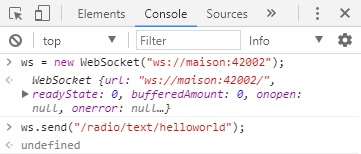

[](https://madnerdorg.github.io/libreconnect/) 

Build your own applications
--------------
<!-- TOC -->

- [Arduino](#arduino)
- [HTML/JS](#htmljs)
- [Web Browser Dev Console](#web-browser-dev-console)
- [NodeJS](#nodejs)

<!-- /TOC -->

Once your arduino is connected, you can send/receive command using **JavaScript**.         
         

Check out [libreInterface](https://github.com/madnerdorg/libreinterface) for more examples.

# Arduino
Check out this [example](https://github.com/madnerdorg/test/blob/master/test/test.ino)

# HTML/JS
The easiest way to control arduino is to build a static web page.    
You just need to create an HTML file.    
```
<script>
var ws = new WebSocket('ws://localhost:42000');
Here is an example to send message
</script>
<button onclick="ws.send('ON')">ON</button>
<button onclick="ws.send('OFF')">OFF</button>
```
Here is an HTML example to send/receive message : http://madnerd.org/interface/basic.html    

# Web Browser Dev Console
You can use the console of your browser to try it.   

```
ws = new WebSocket('ws://localhost:42000');
ws.send('ON');
```

# NodeJS
You can also build a websocket client in NodeJS (or python ...), if you want to 
* Log data from a sensor to a database.
* Automate Tasks
* Centralize websockets and expose it in a secure application     
 
It works almost like a HTML/JS code so you can prototype your application on a web browser.

```
// Install: npm i rwebsocket -S
WebSocket = require('rwebsocket');
var ws = new WebSocket('ws://localhost:42000');
ws.send("ON");
```
Here is a basic example to log temperature/humidity on a CSV file : [https://github.com/madnerdorg/temphum_client](https://github.com/madnerdorg/temphum_client)

