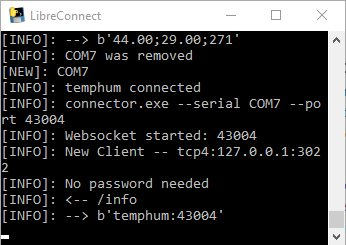

[](https://madnerdorg.github.io/libreconnect/)

    
Here is how to use the python version
Check out **scripts/** folder for more instructions.

#  Software
If you are compiling libreConnect on Linux or a Raspberry Pi, you shouldn't need any software.

On windows You will need :
* Python 2.7     
On windows I recommended you use miniconda Python 2.7
(https://conda.io/miniconda.html) 
* C++ compiler : http://www.visualstudio.com/vs/community

#  Dependencies
You need to install **autobahn/twisted** , **pyserial** and also **pyinstaller** if you want to compile it as an executable.
```
pip install pyserial
pip install twisted
pip install autobahn
pip install service_identity
pip install urlparse2
pip install websocket-client
pip install pyinstaller
pip install pypiwin32
```

On Raspberry Pi if you have this error : TLSVersion.TLSv1_1: SSL.OP_NO_TLSv1_1
```
#Fix for TLSVersion.TLSv1_1: SSL.OP_NO_TLSv1_1
apt-get remove python-openssl
pip install pyopenssl
```


#  Start libreConnect
```
python usb_scanner.py
```


#  Compile
Pyinstaller is a really easy to use python to executable compiler.  
You can compile usb_scanner and connector using these commands
```
pyinstaller --onefile connector.py
pyinstaller --onefile usb_scanner.py
pyinstaller --onefile ws-send.py
```
This will compile libreConnect for your current operating system.    
Keep in mind, It will be slower to start then compiling as multiples files.    
