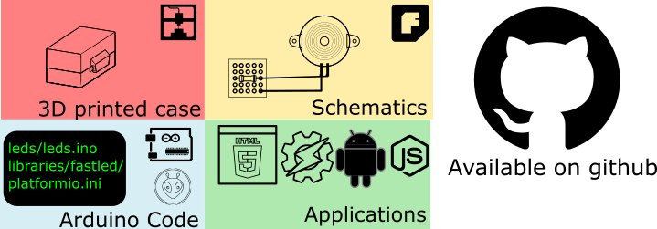
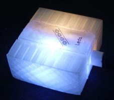
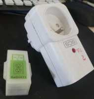
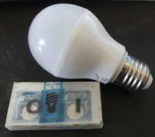
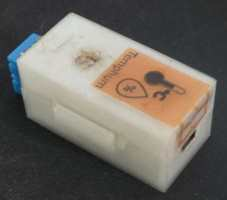

# [Test](#test) / [Leds](#leds) / [Radio433](#radio433) / [OpenLight](#openlight) / [TempHum](#temphum) / [Buzzer](#buzzer)
Each device has instructions/code/applications/schematics.
   

You will need    
* A soldering iron
* [30AWG Wire Wrap Cables](https://www.adafruit.com/product/1446)
* [Stripboard](https://en.wikipedia.org/wiki/Stripboard)
* A 3D printer (for the case)    
* Commons tools (wire cutter/electrical tape/hot glue/adhesive paste)     
* Multimeter (to check connectivity)

# [Test](https://github.com/madnerdorg/test)
A code to learn how to build your own devices, or try libreConnect.       
You can control the **onboard led** of the arduino using this code.      

# [Leds](https://github.com/madnerdorg/leds)
Control 1 or more RGB LEDs.    
You can animate each leds, and change the color using **hsv colors**.    
You can also save the current state of the led in the eeprom of the aduino.    

# [Radio433](https://github.com/madnerdorg/radio433)
Control cheap power outlets, or send/receive messages to others arduino    

# [OpenLight](https://github.com/madnerdorg/openlight)
Control milight bulb directly without the gateway.    
You can optionally use tactile switch to use it as a switch to turn on/off a lamp.    

# [TempHum](https://github.com/madnerdorg/temphum)
Use a DHT11 sensor to measure temperature/humidity, you can also add a photoresistor.     

# [Buzzer](https://github.com/madnerdorg/buzzer)
Use a buzzer as a MIDI instrument.    

