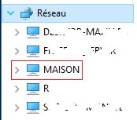
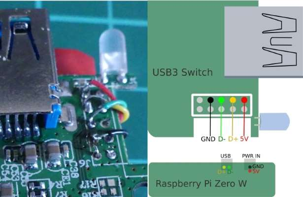

[](https://madnerdorg.github.io/libreconnect/)

- [Install LibreConnect on a Raspberry Pi](#raspberry-piimgrpi_exepng-install-libreconnect-on-a-raspberry-pi)
- [Start at boot](#start-at-boot)
- [Make it visible in Windows Network](#make-it-visible-in-windows-network)
- [Build a Wifi USB Hub](#build-a-wifi-usb-hub)

#  Install LibreConnect on a Raspberry Pi
If you want to install libreConnect inside **/opt/libreConnect**    
[Check the wget url here](https://github.com/madnerdorg/libreconnect/releases)
```
mkdir /opt/libreconnect
cd /opt/libreconnect
wget https://github.com/madnerdorg/libreconnect/releases/download/1.0/libreconnect_rpi_v1.zip
unzip libreconnect_rpi.zip
```

You can then test it with the command:
```
./usb_scanner
```

# Start at boot
Add in **/etc/rc.local** before **exit 0**
```
cd /opt/libreconnect;./usb_scanner &
```
usb_scanner must be start in its folder.

# Make it visible in Windows Network
You can use samba without **sharing files** just to make your Raspberry Pi visible
on windows.    


Install samba
```
apt-get install samba
```
Modify **/etc/samba/smb.conf**
```
#======================= Global Settings =======================
[global]
        workgroup = WORKGROUP
        browseable = yes
        
        load printers = no
		printing = bsd
		printcap name = /dev/null
		disable spoolss = yes

#======================= Name =========================
        #Name of your Raspberry Pi
        netbios name = TORENAME
```

# Build a Wifi USB Hub
Here is a proof-of-concept of a Raspberry Pi Wifi USB Hub that fits in a pocket.     


You can find stl files (and .blend) here: https://github.com/madnerdorg/libreconnect/tree/master/3D/spidersocket

I used an [Anker 4-Port Ultra Slim USB3 Hub](https://www.anker.com/products/A7517011).    


