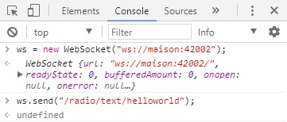

[](https://madnerdorg.github.io/libreconnect/readme_fr.html) 

Créer vos propres applications
--------------
<!-- TOC -->

- [Arduino](#arduino)
- [HTML/JS](#htmljs)
- [Console de développement du navigateur web](#console-de-développement-du-navigateur-web)
- [NodeJS](#nodejs)

<!-- /TOC -->

Une fois que votre arduino est connecté, vous pouvez envoyer/recevoir des commandes à l'aide de **JavaScript**.         
         

Aller sur [libreInterface](https://github.com/madnerdorg/libreinterface) pour voir d'autres examples

# Arduino
Voici un [exemple](https://github.com/madnerdorg/test/blob/master/test/test.ino) pour connecter un arduino à libreConnect

# HTML/JS
La façon la plus facile de contrôler un arduino est de faire une page web statique.
Il vous faut tout simplement créer un fichier HTML
```
<script>
var ws = new WebSocket('ws://localhost:42000');
//Voici comment envoyer un message
</script>
<button onclick="ws.send('ON')">ON</button>
<button onclick="ws.send('OFF')">OFF</button>
```
Voici un autre exemple, un peu plus poussé : [http://madnerd.org/interface/basic.html](http://madnerd.org/interface/basic.html)

# Console de développement du navigateur web
Vous pouvez aussi utiliser la console de votre navigateur web pour tester votre websocket.

```
ws = new WebSocket('ws://localhost:42000');
ws.send('ON');
```

# NodeJS
Si vous voulez créer un client pour votre WebSocket, vous pouvez le faire en NodeJS (ou en python ...). Ceci peut être utile si vous voulez:
* Sauvegarder des données d'un capteur dans une base de données
* Automatiser des tâches
* Centraliser vos websockets afin de les exposer dans une application sécurisée.

NodeJS est plutôt bien conçu pour cela, car il fonctionne quasiment comme une application web, vous pouvez ainsi faire un prototype en HTML/JS puis le convertir en NodeJS.
 
```
// Install: npm i rwebsocket -S
WebSocket = require('rwebsocket');
var ws = new WebSocket('ws://localhost:42000');
ws.send("ON");
```
Voici un example pour sauvegarder des mesures de température/d'humidité dans un fichier cvs[https://github.com/madnerdorg/temphum_client](https://github.com/madnerdorg/temphum_client)

