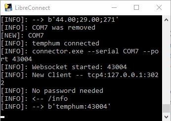

[](https://madnerdorg.github.io/libreconnect/readme_fr.html)

    
Voici comment utiliser directement le code en python
Aller voir dans **scripts/** pour plus d'informations.

#  Logiciel nécessaires
Si vous compilez libreConnect sur un Raspberry Pi ou Linux, vous ne devriez pas avoir besoin de faire ceci.

Sur windows, vous aurez besoin de :
* Python 2.7     
Je recommande l'usage de miniconda Python 2.7
(https://conda.io/miniconda.html) 
* Un compilateur C++ : http://www.visualstudio.com/vs/community

#  Dépendances
Vous devez installer **autobahn/twisted** , **pyserial** ainsi que **pyinstaller** si vous voulez compiler l'application.
```
pip install pyserial
pip install twisted
pip install autobahn
pip install service_identity
pip install urlparse2
pip install websocket-client
pip install pyinstaller
pip install pypiwin32
```

Sur un Raspberry Pi si vous avez cette erreur : TLSVersion.TLSv1_1: SSL.OP_NO_TLSv1_1
```
#Fix for TLSVersion.TLSv1_1: SSL.OP_NO_TLSv1_1
apt-get remove python-openssl
pip install pyopenssl
```


#  Lancer libreConnect
```
python usb_scanner.py
```


#  Compiler
Pyinstaller est un programme très simple pour compiler un script python en un exécutable.
Pour compiler usb_scanner/connector/ws-send utiliser ces commandes
```
pyinstaller --onefile connector.py
pyinstaller --onefile usb_scanner.py
pyinstaller --onefile ws-send.py
```
Ceci compilera libreConnect pour le système d'exploitation en cours d'utilisation.
Les programmes sont compilés dans des fichiers unique, bien que cela ralentisse légèrement leur démarrage.
