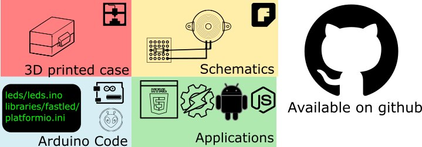

# [Test](#test) / [Leds](#leds) / [Radio433](#radio433) / [OpenLight](#openlight) / [TempHum](#temphum) / [Buzzer](#buzzer)
Chaque appareils est fourni avec des instructions/codes/applications/schémas.
   

Vous aurez besoin  
* D'un fer à souder
* [Cables 30AWG Wire Wrap](https://www.adafruit.com/product/1446)
* [Des Stripboard](https://en.wikipedia.org/wiki/Stripboard)
* Une imprimante 3D (pour les boitiers)    
* Des outils (pinces coupantes/rubant isolant/colle chaude/patte adhésive)     
* Multimètre (pour vérifier la connectivité)

# [Test](https://github.com/madnerdorg/test)
Un code pour apprendre à faire ces propres appareils, ou essayer libreConnect
Contrôler la led embarqué d'un arduino avec ce code.

# [Leds](https://github.com/madnerdorg/leds)
Controler une ou plus leds rgb.
Vous pouvez animer les leds, ainsi que changer leur couleurs en utilisant la norme HSV (Teinte/Saturation/Valeur)
Vous pouvez aussi sauvegarder l'état actuel des leds dans (la mémoire) l'eeprom de l'arduino

# [Radio433](https://github.com/madnerdorg/radio433)
Contrôler des prises de courants et envoyer/recever des messages d'autres arduino.    

# [OpenLight](https://github.com/madnerdorg/openlight)
Controler des lampes milight directement sans passerelle.
Vous pouvez ,en option, rajouter des boutons tactiles pour éteindre/allumer une lampe. 

# [TempHum](https://github.com/madnerdorg/temphum)
Utiliser un capteur DHT11 pour mesurer la température/humidité, vous pouvez ,en option, ajouter une photo-résistance (luminosité)  

# [Buzzer](https://github.com/madnerdorg/buzzer)
Contrôler un buzzer comme si c'était un instrument MIDI.    

