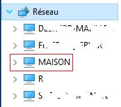
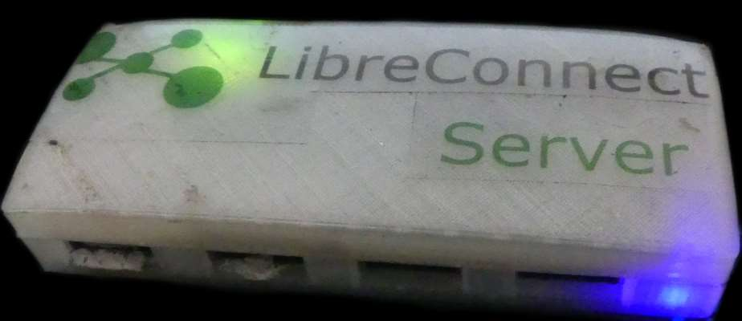
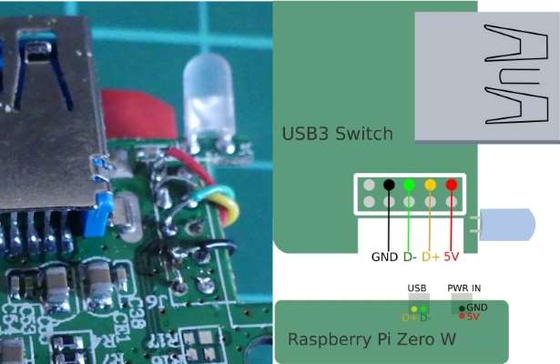

[](https://madnerdorg.github.io/libreconnect/readme_fr.html)

- [Installer LibreConnect sur un Raspberry Pi](#raspberry-piimgrpi_exepng-installer-libreconnect-sur-un-raspberry-pi)
- [Lancer au démarrage](#lancer-au-démarrage)
- [Rendre votre raspberry pi visible dans le réseau Windosw](#rendre-votre-raspberry-pi-visible-dans-le-réseau-windosw)
- [Fabriquer un hub wifi](#fabriquer-un-hub-wifi)

#  Installer LibreConnect sur un Raspberry Pi
Si vous voulez installer libreConnect dans **/opt/libreConnect**    
[Vérifier le lien ici](https://github.com/madnerdorg/libreconnect/releases)
```
mkdir /opt/libreconnect
cd /opt/libreconnect
wget https://github.com/madnerdorg/libreconnect/releases/download/97f9aff/libreconnect_rpi.zip
unzip libreconnect_rpi.zip
```
Vous pouvez tester libreConnect avec cette commande:
```
./usb_scanner
```

# Lancer au démarrage
Dans **/etc/rc.local** avant **exit 0**
```
cd /opt/libreconnect;./usb_scanner &
```
> usb_scanner doit être lancé dans son dossier.

# Rendre votre raspberry pi visible dans le réseau Windosw
Vous pouvez utiliser samba sans **partager de fichiers** pour rendre votre Raspberry Pi visible sous Windows


Installer samba
```
apt-get install samba
```
Modifier **/etc/samba/smb.conf**
```
#======================= Global Settings =======================
[global]
        workgroup = WORKGROUP
        browseable = yes
        
        load printers = no
		printing = bsd
		printcap name = /dev/null
		disable spoolss = yes

#======================= Name =========================
        #Name of your Raspberry Pi
        netbios name = TORENAME
```

# Fabriquer un hub wifi
Voici un concept pour créer un hub wifi à l'aide d'un Raspberry Pi Zero W qui tient dans une poche.


Vous pouvez trouver les fichiers stl files (et .blend) ici: https://github.com/madnerdorg/libreconnect/tree/master/stl/spidersocket

J'ai utiliser un [Hub Anker 4-Port Ultra Slim USB3](https://www.anker.com/products/A7517011).    


