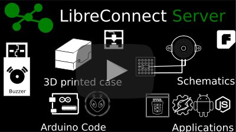
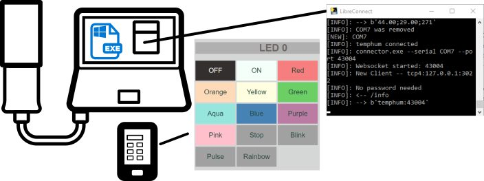
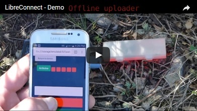
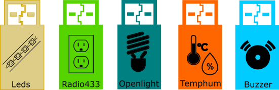
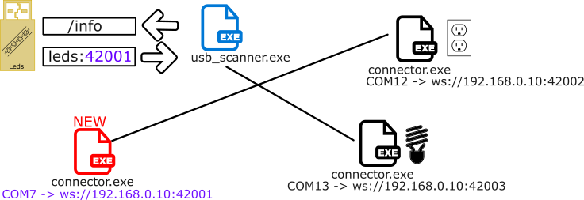

[English](https://madnerdorg.github.io/libreconnect/)

[](https://github.com/madnerdorg/libreconnect/releases)    
[](https://github.com/madnerdorg/libreconnect/releases)    
[Télécharger](https://github.com/madnerdorg/libreconnect/releases) / [Aller sur madnerd.org](https://madnerd.org) / [Vidéos](https://www.youtube.com/channel/UCdtmROCsWKdaN7JEuqZoquA)

- [C'est quoi libreConnect ?](#cest-quoi-libreconnect-)
- [Appareils](#appareils)
- [Paramétrer LibreConnect](#paramétrer-libreconnect)
- [Comment libreConnect fonctionne](#comment-libreconnect-fonctionne)
- [Créer ses propres applications](doc/fr/applications.md)
- [Compiler LibreConnect](doc/fr/compile.md)
- [Utiliser libreConnect sur un Raspberry Pi](doc/fr/raspberrypi.md)]
- [Liens utiles / source](#liens-utiles--source)
- [License](#license)

# C'est quoi libreConnect ?
LibreConnect est un logiciel qui permet de contrôler des arduinos à l'aide de **websockets**.    
Branchez un arduino sur un ordinateur ou un Raspberry Pi et contrôlez-le à l'aide de votre **navigateur web**        
[](https://www.youtube.com/watch?v=RrZaXerJBO8)  

**Aucun installation ou configuration n'est nécessaire**
* [Télécharger](https://github.com/madnerdorg/libreconnect/releases) libreConnect
* Cliquer sur **usb_scanner**
* Brancher votre Arduino en USB.
* Essayer votre appareil sur [madnerd.org/interface](http://madnerd.org/interface)    

> Toutes les applications sont des pages web statiques, aucune donnée n’est envoyée à madnerd.org

Avec une connaissance basique de HTML et JavaScript vous pouvez créer vos propres télécommandes pour contrôler des leds, capteurs, boutons, de la radio, n'importe quoi!   
Pas besoin de serveur web pour utiliser ces applications, tout fonctionne dans votre navigateur web.



# Appareils
[](https://www.youtube.com/watch?v=7xJIdO-WGD4)

Voici les [appareils](https://madnerdorg.github.io/libreconnect/doc/fr/devices.html) que j'ai fabriqué pour LibreConnect, ils ne coûtent pas cher et sont faciles à fabriquer.     
Ils sont aussi faciles à **recycler** et **améliorer**.    

[](https://madnerdorg.github.io/libreconnect/doc/fr/devices.html)

Du moment que votre code Arduino est capable **d'envoyer/recevoir** des commandes à l'aide de l'USB.    
Vous pouvez l'utiliser avec libreconnect.    
 

Voilà quelques projets sympas , que vous pouvez faire avec libreConnect  
* [Contrôler des lampes et des prises de courant](http://madnerd.org/interface/homeautomation).
* Soyez prévenu quand vous recevez un appel , à l'aide de [tasker sur android](https://madnerdorg.github.io/leds/readme.fr)
* Contrôler un buzzer à l'aide de n'importe lequel [logiciel de musique](https://madnerdorg.github.io/buzzer/readme.fr).
* Construire des appareils et les utiliser en pleine nature! [video](https://www.youtube.com/watch?v=sHwIgMWFc-8)
* Faire ses propres [applications web](http://madnerd.org/interface/editor) en utilisant uniquement son navigateur web

# Paramétrer LibreConnect

## Paramètres
Bien qu'il ne soit pas nécessaire de paramétrer libreConnect, vous pouvez utiliser des paramètres pour
* Utiliser votre arduino uniquement depuis votre ordinateur
* Chiffrer / protéger à l'aide d'un mot de passe votre websocket
* Connectez n'importe quel arduino (ou périphériques série)

```
  -h, --help           show this help message and exit
  --serial SERIAL      Serial port
  --port PORT          Websocket port
  --secure             Add SSL
  --power              Add power management (@reboot/@poweroff)
  --password PASSWORD  Password for the websocket
  --local              Websocket will only be available locally
  --bantime BANTIME    Seconds before a ban user is unbanned
  --retry RETRY        Number of retry before ban
  --baudrate BAUDRATE  Baudrate for serial com
  --keys KEYS          folders where SSL certificates are
  --force              Connect any serial devices
  --settings SETTINGS  Setting file
  --debug              Debug Mode
  --password_hash      Hashed password for websocket
```
## Fichier de configuration (v1.1)
Vous pouvez utiliser un fichier de configuration (un fichier ini) pour paramétrer usb_scanner et connector     
Un exemple est disponible dans le fichier **libreconnect.ini.example** (par défaut libreconncet.ini est utilisé)
```
usb_scanner --settings settings/libreconnect.ini
```

## Ne pas connecter au réseau
Si vous voulez utiliser libreConnect uniquement sur la machine sur laquelle il est branché, ajouter simplement **--local**.
> Il est recommandé de faire ceci **si vous n'êtes pas sur votre réseau.** 
>
```
usb_scanner --local
```
Vous pourrez toujours utiliser vos **applications web** 

## Connectez n'importe quel périphérique série.
Vous n'avez pas besoin de modifier votre code arduino pour utiliser **libreConnect**, utiliser **connector.exe** à la place de **usb_scanner.exe**
Comme libreConnect ne peut pas deviner le port série de votre arduino, vous devrez le préciser, ainsi que le **baudrate** et le **port websocket**:
```
./connector --serial "COM7" --baudrate 115200 --port 43100
```

Vous pouvez aussi utiliser la commande
```
usb_scanner --force --baudrate 9600
```
Ceci connectera tout les périphériques série avec un baudrate de 9600 en commençant par le port 40001

## Mot de passe hash (v1.2)
Générer un hash pour le mot de passe (Il est conseillé de l'utiliser dans un fichier de configuration)
```
generate_password --password HorseBatteryStaple
```

```
usb_scanner --password_hash $argon2i$v=19$m=512,t=2,p=2$oGywE+G38a/7zx48GgG99A$NDvr/qtQ2tH4mJvUWN6zdg
```

##  Mots de passe
Les hash de mot de passe sont disponible maintenant, il n'est pas conseillé d'utiliser ce paramètre.   
Je vous recommande fortement d'utiliser une connexion chiffrée où votre mot de passe sera envoyé **en clair** sur votre réseau.
Si vous ne pouvez pas utiliser des certificats SSL, utiliser un **mot de passe temporaire**

```
usb_scanner --password HorseBatteryStaple
```

Voici un code pour connecter un websocket avec un mot de passe.
```
password = HorseBatteryStaple
ws = new WebSocket("ws://localhost:42000");
ws.onmessage = ws_onmessage;

function ws_onmessage(event){
  if(event.data == "@password"){
    ws.send(password);
  }
}
```

###  Bannisement / Essai
Vous pouvez bannir une IP qui a entré trop de fois un mauvais mot de passe.
Par exemples ici, tout IP qui aura échoué de rentrer un mot de passe 5 fois, ne pourra plus se connecter pendant 60 secondes.
``` 
usb_scanner --password HorseBatteryStaple --bantime 60 --retry 5
```

##  Chiffrement
Par défaut, les websockets ne sont pas chiffrés.
Pour utiliser une connexion chiffrée, il nous faut un **certificat SSL**

###  Certificat autosigné (self-signed)
Créer un certificat autosigné est relativement facile, toutefois, votre navigateur ne se connectera pas à un websocket chiffré avec un certificat autosigné.  
       
Il vous faut valider le certificat, en allant sur l'IP et le port de votre websocket : https://ip:port.    
Par example, https://localhost:42001

Un certificat SSL est disponible dans keys/ pour tester, attention, il vous faut recréer ce certificat pour vraiment avoir une communication protégé (car la clé privée est accessible publiquement)

Pour connecter vos websocket en SSL tapez:
```
usb_scanner --secure
```
Si vous voulez mettre les certificats dans un autre dossier que keys/, vous pouvez le changer comme ceci:
```
./usb_scanner --secure --keys "/etc/libreconnect/keys"
```

Dans **scripts/** il y a un script (openssl.bat) pour générer un nouveau certificat


###  Certificat Let's Encrypt
Vous pouvez aussi générer un certificat valide grâce à let's encrypt.     
Mais ceci est loin d'être simple et n'est utile que si vous accédez à votre websocket depuis internet.
 
Source: https://certbot.eff.org/#pip-other

* Il nous faut un domaine DNS (**par example devices.example.org**) qui redirige vers votre adresse IP
* Il nous faut aussi ouvrir un **port 80**, depuis notre router
* Sur un terminal **Raspberry Pi** / **Linux**, tapez:
```    
wget https://dl.eff.org/certbot-auto
chmod a+x certbot-auto
```
Ceci va récupérer le programme pour générer un certificat.    
Après il nous faut générer le certificat manuellement
```
./certbot-auto certonly --manual -d devices.example.org
```
* Suivez les instructions, et lancez un serveur web temporaire sur un autre terminal
* Récupérer les certificats crées, et copiez les dans keys/

##  Allumer / Eteindre à distance
Si vous voulez pouvoir allumer/éteindre une machine à distance, vous pouvez utiliser --power
```
./usb_scanner --power
```

Puis envoyer sur le websocket:
```
Turn off server: @poweroff
Reboot server: @reboot
```

# Comment libreConnect fonctionne
LibreConnect , c'est deux scripts python compilé:    
     
* usb_scanner cherche des périphériques USB série qui viennent d'être branchée.
* Puis leur envoi **/info**
* Si le périphérique répond **device:port**,      
* Alors une instance de **connector.exe** est crée et connecte le port série à un websocket grâce à [autobahn](http://crossbar.io/autobahn/)   
           


# [Créer ses propres applications](doc/fr/applications.md)

# [Compiler LibreConnect](doc/fr/compile.md)

# [Utiliser libreConnect sur un Raspberry Pi](doc/fr/raspberrypi.md)

# Liens utiles / source    
Crossbar.io - Echo_tls Autobahn example        
[https://github.com/crossbario/autobahn-python/tree/master/examples/twisted/websocket/echo_tls](https://github.com/crossbario/autobahn-python/tree/master/examples/twisted/websocket/echo_tls)  

Simplyautomationized.blogspot.fr      
5 ways to secure your raspberry pi's websocket server       
[http://simplyautomationized.blogspot.fr/2015/09/5-ways-to-secure-websocket-rpi.html](http://simplyautomationized.blogspot.fr/2015/09/5-ways-to-secure-websocket-rpi.html)

madnerd.org - Control Arduino with a portable app     
[http://www.instructables.com/id/UTest-Make-USB-Devices-With-Arduino/](http://www.instructables.com/id/UTest-Make-USB-Devices-With-Arduino/)

# License
* LibreConnect : MIT - Rémi Sarrailh [http://madnerd.org](http://madnerd.org)
* Autobahn : MIT - Crossbar.io [http://autobahn.ws/python/](http://autobahn.ws/python/)
* Pyserial : BSD-3 - Chris Liechti [https://github.com/pyserial/pyserial](https://github.com/pyserial/pyserial)
* Twisted : MIT - Glyph Lefkowitz [https://pypi.python.org/pypi/Twisted](https://pypi.python.org/pypi/Twisted)
* Icons / Images are from the [https://thenounproject.com/](https://thenounproject.com/) (Creative Commons By): [Complete licence](doc/img/licence.txt)

